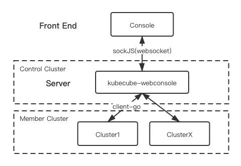

# kubecube-webconsole

[](https://https://github.com/kubecube-io/kubecube/blob/main/LICENSE)  [](https://github.com/kubecube-io/KubeCube/actions/workflows/build.yml)


> English | [中文文档](README-zh_CN.md)

### Architecture

kubecube-webconsole excludes two functions mainly:

-Real-time interaction between front-end and server
-Real-time interaction between the server and the computing cluster

The front end and the server use the websocket protocol to communicate, and the server and the container in the Kubernetes cluster use the SPDY protocol to communicate.

The overall architecture diagram is as follows:



### Connection Process

1. The front end sends an http request to the server to obtain the sessionID for websocket connection verification
2. Create a websocket connection through the obtained sessionID (connection method: front-end through sockjs), then realize socket interaction, and obtain the data sent by the client (that is, the command entered at the client terminal)
3. Send the corresponding data to the specified container through client-go, get the returned data, and send it back to the client terminal
4. The client terminal uses xterm.js/hterm.js to do related display.

### Main Interface Definition

During the interaction between the front and webconsole, there is two API calls:

- Pass in the container load information to get the sessionId. The connection is a normal http connection:
  `/api/v1/{cluster}/namespace/{namespace}/pod/{pod}/shell/{container} ` return sample：
  `{  "id": "3a9ae585ceaa6e3b0c72c31b0c215187" }`
- Establish a websocket connection through sessionId. The webconsole service provides a sockjs interface. When the front end calls the sockjs interface, it is a normal http call. After the interface returns successfully, sockjs will automatically establish a websocket connection. Therefore, this API requires all nodes on the link to support websocket.
  API： `/api/sockjs/info?3a9ae585ceaa6e3b0c72c31b0c215187&t=1548837417633`
  The API has 2 URL parameters, the first is the sessionId (without key) obtained in the previous step, and the second is a timestamp (key is t).
  return sample：
  `{"websocket":true,"cookie_needed":false,"origins":["*:*"],"entropy":1983920037}`
  The value of websocket is `true`, indicates that the sockjs used in webconsole has the websocket function enabled, so the front-end sockJs will establish a websocket connection with webconsole.

## Feedback & Contact

[FAQ](https://www.kubecube.io/docs/faq/)

## License

```
Copyright 2021 KubeCube Authors

Licensed under the Apache License, Version 2.0 (the "License");
you may not use this file except in compliance with the License.
You may obtain a copy of the License at

    http://www.apache.org/licenses/LICENSE-2.0

Unless required by applicable law or agreed to in writing, software
distributed under the License is distributed on an "AS IS" BASIS,
WITHOUT WARRANTIES OR CONDITIONS OF ANY KIND, either express or implied.
See the License for the specific language governing permissions and
limitations under the License.
```